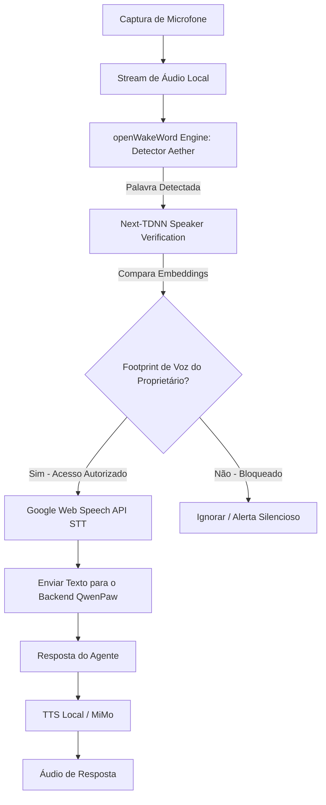

# Aether

**Aether** é uma estação de trabalho multi-agente avançada e moderna, desenvolvida como um fork do projeto de código aberto [QwenPaw](https://github.com/agentscope-ai/QwenPaw) da equipe do **AgentScope**.

O projeto descarta completamente o sistema legado de módulos HUD e aproveita aprendizados de voz e biometria local para criar uma interface de controle premium com design *Flat Blue*, Canvas Dinâmico de interações visuais e segurança por reconhecimento biométrico de voz.

---

## 🎨 Identidade Visual e Experiência de Uso

*   **Tema Flat Blue (Azul Plano):** Substituição completa do laranja neon original do QwenPaw por uma estética limpa em azul elétrico premium (`#1677ff`), com fundos escuros e sólidos, bordas finas e sombras sutis.
*   **Visualização Dividida (Split View):** 
    *   **Coluna Esquerda:** Console de chat principal para interação com os agentes.
    *   **Coluna Direita:** **Canvas Dinâmico** que renderiza apresentações de slides (MIRA Animator), tabelas, gráficos e interfaces interativas instantaneamente.
    *   **Divisor Central:** Barra vertical interativa que permite redimensionar as colunas de forma fluida.

---

## 🎙️ Pipeline de Voz e Biometria de Segurança

O Aether implementa um pipeline de voz offline/local extremamente seguro para garantir que o console só responda aos comandos de voz do seu proprietário:



### Principais Componentes Técnicos
1.  **WakeWord Engine:** Detecção local via `openwakeword-wasm-browser` no navegador com carregamento dinâmico de modelos ONNX (ex: `aether.onnx`, `assistant.onnx`) salvos na pasta `/models/openwakeword/`.
2.  **Verificação de Orador (Biometria):** Integração com `@jaehyun-ko/speaker-verification` no frontend para extrair embeddings de voz da frase de ativação e compará-los com o footprint gravado pelo proprietário.
3.  **Onboarding Interativo:** Interface amigável no console para cadastrar e recalibrar a biometria gravando 3 amostras curtas e salvando o vetor médio no LocalStorage.
4.  **STT (Speech-to-Text):** Transcrição rápida de português via **Google Web Speech API** nativa do navegador.

---

## 🎨 Canvas Dinâmico Reativo

O canvas do lado direito é alimentado em tempo real usando **WebSockets** a partir do backend:
1.  O agente decide exibir um componente ou slide interativo.
2.  O backend executa a skill `canvas_writer` que atualiza o arquivo local e transmite o conteúdo via WebSocket (`/ws/canvas`).
3.  O componente `<AetherCanvas />` no console React atualiza o iframe instantaneamente com transições visuais fluidas.

---

## 🛠️ Como Executar o Projeto

### Pré-requisitos
*   **Python:** Versão 3.10 ou superior (Python 3.14.2 suportado)
*   **Node.js:** Versão 18 ou superior

### Passo 1: Inicialização do Backend
Entre na pasta `aether-core` e instale as dependências locais:
```bash
cd aether-core
pip install -e .
qwenpaw init --defaults --accept-security --force
```

### Passo 2: Execução
Para iniciar o console e o backend simultaneamente:
```bash
qwenpaw app
```

---

## 📚 Créditos e Licença

Este projeto é um fork do **QwenPaw**, desenvolvido originalmente por **AgentScope-AI**. Expressamos nossos agradecimentos à equipe de desenvolvimento do AgentScope pelo excelente trabalho na criação do assistente pessoal automatizado.

*   Repositório Original: [github.com/agentscope-ai/QwenPaw](https://github.com/agentscope-ai/QwenPaw)
*   Documentação Original: [qwenpaw.agentscope.io](https://qwenpaw.agentscope.io/)

Aether mantém a licença original do QwenPaw. Para mais detalhes, consulte o arquivo [LICENSE](aether-core/LICENSE).
