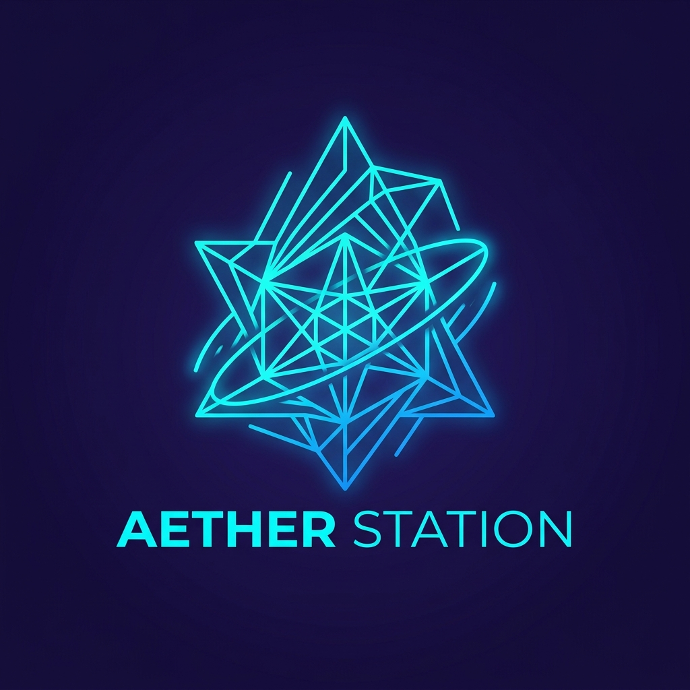
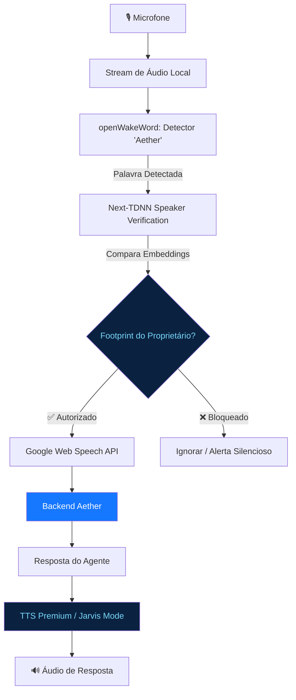
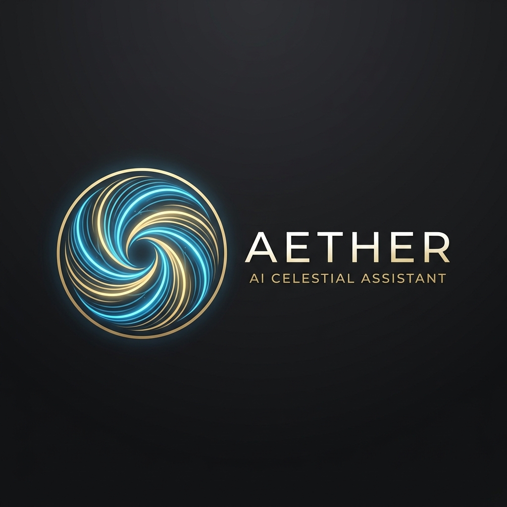

<div align="center">



# AETHER STATION

**A camada invisível de inteligência que conecta dados e resolve o impossível.**

[](https://python.org)
[](https://nodejs.org)
[](https://fastapi.tiangolo.com)
[](https://react.dev)
[](LICENSE)

</div>

---

<div align="center">

> *"No mundo antigo, o Éter era o ar puro que os deuses respiravam — o quinto elemento que preenchia o cosmos além das estrelas.  
> Para nós, é a camada invisível de inteligência que conecta dados, flui silenciosamente e resolve o que parece impossível."*

</div>

---

## ✨ O que é o Aether?

**Aether Station** é uma estação de trabalho multi-agente avançada, desenvolvida como um fork do [QwenPaw](https://github.com/agentscope-ai/QwenPaw) da equipe **AgentScope**. O projeto vai muito além do assistente original: descarta o sistema legado de HUD, reimagina completamente a interface e adiciona capacidades únicas de voz, biometria e visualização em tempo real.

<br/>

<div align="center">

| 🎨 Design Flat Blue | 🎙️ Voz + Biometria | 🖼️ Aether Canvas | 🤖 Multi-Agente |
|:---:|:---:|:---:|:---:|
| Estética premium em azul elétrico `#1677ff` | Pipeline de reconhecimento do proprietário | Canvas dinâmico em tempo real | Orquestração de múltiplos agentes |

</div>

---

## 🖥️ Interface

<div align="center">

```
┌────────────────────────────────┬──────────────────────────────────┐
│                                │                                  │
│       CHAT / CONSOLE           │        AETHER CANVAS             │
│                                │                                  │
│  > Você: "Crie um slide..."    │  ┌────────────────────────────┐  │
│                                │  │  Slides / Relatórios       │  │
│  ✦ Aether: Gerando...          │  │  Navegador Live            │  │
│                                │  │                            │  │
│  > Você: "Abra o site X"       │  │  [Canvas interativo aqui]  │  │
│                                │  │                            │  │
│  ✦ Aether: Abrindo no          │  └────────────────────────────┘  │
│            navegador...        │                                  │
└────────────────────────────────┴──────────────────────────────────┘
```

</div>

---

## 🎨 Identidade Visual

A paleta oficial do Aether foi cuidadosamente definida para transmitir tecnologia, sofisticação e poder divino:

<div align="center">

| Aplicação | Cor | HEX | Uso |
|:---:|:---:|:---:|:---:|
| **Fundo Principal** |  | `#0A2240` | Fundos, header, sidebar |
| **Brilho Primário** |  | `#79D7FF` | Acentos, gradientes, glow |
| **Azul Elétrico** |  | `#1677ff` | Botões, links, interações |
| **Metálico** |  | `#A0B2C6` | Linhas, bordas, texto secundário |

</div>

---

## 🎙️ Pipeline de Voz e Biometria

O Aether só responde aos comandos de voz do seu **proprietário legítimo**:



### Componentes de Voz

| Componente | Tecnologia | Função |
|---|---|---|
| **Wake Word** | `openwakeword-wasm-browser` | Detecta "Aether" offline no browser |
| **Biometria** | `@jaehyun-ko/speaker-verification` | Verifica embeddings de voz |
| **STT** | Google Web Speech API | Transcrição em português |
| **TTS** | Modo Jarvis (remoto/local) | Síntese de voz premium |

---

## 🖼️ Aether Canvas — Visualização Dinâmica

O canvas lateral é alimentado em **tempo real via WebSocket**:

```
Agente decide exibir algo
        │
        ▼
Backend executa a skill
        │
        ├──▶ create_presentation() → Slides com tema Aether
        ├──▶ browser_use()         → Navegador Live interativo
        └──▶ canvas_writer()       → HTML/componentes custom
        │
        ▼
WebSocket /ws/canvas
        │
        ▼
<AetherCanvas /> atualiza instantaneamente
```

### Recursos do Canvas

- 🎞️ **Slides / Relatórios** — Apresentações com tema Aether (glassmorphism, gradientes)
- 🌐 **Navegador Live** — Browser Playwright interativo em tempo real
- 📊 **Gráficos e Dashboards** — Componentes visuais gerados pelo agente
- 📡 **Transmissão** — Botão para projetar em TV/Projetor via URL pública

---

## 🛠️ Como Executar

### Pré-requisitos

- **Python** 3.10+ 
- **Node.js** 18+
- **Git**

### Instalação

```bash
# 1. Clone o repositório
git clone https://github.com/murilozone-arch/Aether.git
cd Aether/aether-core

# 2. Instale as dependências Python
pip install -e .

# 3. Inicialize o projeto
qwenpaw init --defaults --accept-security --force

# 4. Execute
qwenpaw app
```

O console estará disponível em `http://localhost:8088`

### Variáveis de Ambiente

```env
# .env na pasta aether-core
QWENPAW_RELOAD_MODE=false
QWENPAW_BROWSER_USE_DEFAULT=true
```

---

## 📁 Estrutura do Projeto

```
Aether/
├── assets/                    # Logos e recursos visuais
│   ├── logo.png              # Logo principal (fundo escuro)
│   └── logo_dark.png         # Logo variante
├── aether-core/               # Backend Python + Frontend React
│   ├── src/qwenpaw/          # Código Python do agente
│   │   ├── agents/tools/     # Ferramentas (browser, canvas, TTS...)
│   │   └── app/routers/      # API FastAPI
│   └── console/              # Interface React/TypeScript
│       └── src/components/
│           └── AetherCanvas/ # Canvas dinâmico
└── README.md
```

---

## 🔮 Roadmap

- [x] Interface Flat Blue — Estética premium com azul elétrico
- [x] Aether Canvas — Visualização dinâmica em tempo real
- [x] Tema de Apresentações Aether — Glassmorphism + gradientes
- [x] Biometria de Voz — Pipeline de verificação do proprietário
- [x] Logo e Identidade Visual Oficial
- [ ] Navegador Live Interativo — Canvas + proxy reverso
- [ ] Modo Privado — Pausa o acesso do agente ao screen
- [ ] TTS Jarvis v3 — Síntese de voz remota premium
- [ ] App Desktop (Tauri) — Versão nativa Windows/macOS

---

## 📚 Créditos e Licença

<div align="center">



</div>

Este projeto é um fork do **QwenPaw**, desenvolvido originalmente pela equipe **AgentScope-AI**.  
Agradecemos ao **Professor Sandeco** pela criação do **MIRA Animator**, cuja identidade visual e conceitos estéticos inspiraram profundamente o design do Aether Canvas.

| Recurso | Link |
|---|---|
| 🏠 Repositório original QwenPaw | [github.com/agentscope-ai/QwenPaw](https://github.com/agentscope-ai/QwenPaw) |
| 📖 Documentação QwenPaw | [qwenpaw.agentscope.io](https://qwenpaw.agentscope.io/) |
| 🎬 MIRA Animator — Prof. Sandeco | [sandeco.github.io/mira-animator/pt/](https://sandeco.github.io/mira-animator/pt/) |

Aether mantém a licença original Apache 2.0 do QwenPaw.  
Consulte o arquivo [LICENSE](aether-core/LICENSE) para mais detalhes.

---

<div align="center">

*Feito com ✦ no Brasil*  
**AETHER STATION** — *O Quinto Elemento da Inteligência Artificial*

</div>
