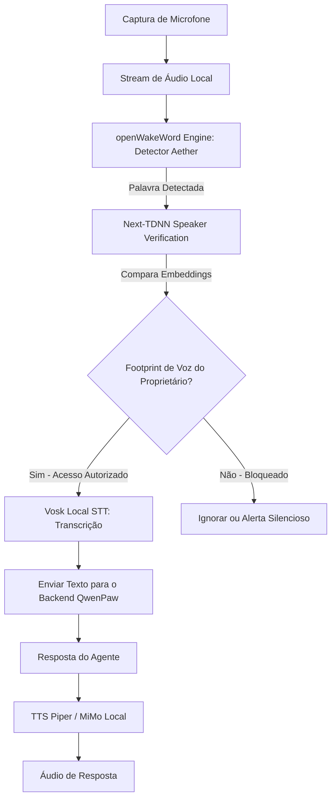

# Especificação de Projeto: Aether (Fork do QwenPaw)

Este documento contém o guia de arquitetura e as instruções passo a passo para a criação do seu novo projeto, o **Aether**, desenvolvido como um fork do **QwenPaw**. 

Este projeto descarta completamente o sistema legado de módulos HUD (Navegador Web e Terminal) e aproveita o aprendizado de voz e biometria local para criar uma estação de trabalho multi-agente moderna, com design plano azul premium, um canvas de interações visuais dinâmicas e segurança por reconhecimento de voz.

---

## 📐 Diretrizes de Design e Identidade Visual

### 1. Paleta de Cores e Estética
*   **Tema Azul Plano (*Flat Blue*)**: 
    *   Substitua o laranja original do QwenPaw por um azul premium e limpo.
    *   **Cor Primária sugerida**: `#1677ff` (azul moderno padrão do Ant Design) ou `#0066ff` (azul elétrico).
*   **Remoção de Efeitos Holográficos**:
    *   Elimine scanlines, ruídos de vídeo, glows neon brilhantes ou fontes monospace de terminais antigos. O Aether deve parecer um painel administrativo ou console de controle de alto padrão: limpo, com bordas finas, sombras sutis e fundos escuros/claros sólidos.

### 2. Layout da Interface (Chat + Canvas)
*   **Disposição Dividida (*Split View*)**:
    *   **Lado Esquerdo**: Chat principal do console (baseado no componente de WebUI do QwenPaw).
    *   **Lado Direito**: O **Canvas Dinâmico**. Este espaço substitui os módulos antigos. Em vez de abas, é uma tela única onde o agente exibe apresentações (MIRA Animator), componentes HTML5 interativos, gráficos ou tabelas dinâmicas em resposta direta à conversa.

---

## 🎙️ Arquitetura do Pipeline de Voz e Biometria

O diferencial de segurança e interface do Aether é a capacidade de interagir por voz local de forma segura, garantindo que o agente só responda a comandos do proprietário.



### 1. Componentes Técnicos do Pipeline
*   **STT Local (Speech-to-Text)**: Vosk Browser (via Web Assembly) ou modelo local Whisper via FastAPI no backend para transcrição rápida em português offline.
*   **TTS Local (Text-to-Speech)**: Piper TTS ou API do MiMo-TTS para geração de voz de alta fidelidade com sotaque natural em português.
*   **Detector de WakeWord**: `openwakeword-wasm-browser` configurado com carregamento dinâmico do modelo ONNX. O usuário pode escolher ou definir o nome da palavra de ativação nas configurações (ex: "Aether", "Assistant", "Lia", "Alexa"), e o sistema carrega o arquivo de modelo correspondente (ex: `aether.onnx`, `assistant.onnx`) do diretório local `/models/openwakeword/` em tempo de execução.
*   **Verificação de Orador (Biometria)**:
    *   Biblioteca: `@jaehyun-ko/speaker-verification`.
    *   No carregamento do app, o usuário grava sua voz para gerar um `speakerFootprint` (vetor de embedding da voz do proprietário).
    *   A cada ativação da palavra de ativação escolhida pelo usuário, o áudio de ativação é transformado em embedding e comparado via similaridade de cosseno com o footprint do proprietário. O comando só avança se a similaridade for superior ao limiar configurado (ex: `0.75`).

---

## 🎨 O Canvas Dinâmico de Interações Visuais

Em vez de iframes de navegador web ou terminal estático, o Aether implementará um **Canvas Dinâmico** que serve como a tela de desenho do agente.

### 1. Como funciona a interação visual?
1.  Durante a conversa, o agente de IA decide que precisa exibir dados visuais (como slides, um gráfico ou uma interface).
2.  O agente executa uma ferramenta/habilidade de escrita de arquivo que atualiza o arquivo `public/modules/canvas.html` (ou via WebSocket enviando blocos de código JSX/HTML).
3.  O componente Canvas no frontend escuta essas atualizações (via pooling local de arquivo ou conexões de WebSocket) e atualiza o conteúdo na tela do lado direito instantaneamente com efeitos de transição limpos.
4.  **Suporte a Apresentações**: Se o agente gerar um deck do MIRA Animator, o Canvas renderiza o deck de slides em tela cheia na metade direita, sincronizando com a fala do robô (via controle de rotação de slides).

---

## 🛠️ Guia Passo a Passo de Desenvolvimento

### Passo 1: Inicialização do Fork e Dependências
1.  Crie a pasta do projeto e inicialize o repositório git.
2.  Crie a pasta `aether-core` clonando a estrutura do QwenPaw.
3.  Edite o arquivo `pyproject.toml` no backend para relaxar as versões de instalação de dependências para suportar o Python do seu ambiente.
4.  Execute a instalação do backend no seu ambiente virtual:
    ```bash
    pip install -e .
    qwenpaw init --defaults --accept-security --force
    ```

### Passo 2: Redesenho do CSS e Configuração do Ant Design
1.  Abra `aether-core/console/src/App.tsx`. Localize o `ConfigProvider` e altere o token primário:
    ```tsx
    token: {
      colorPrimary: "#1677ff", // Azul premium
    }
    ```
2.  Localize e edite os arquivos de estilos (como `layout.css`). Substitua todas as instâncias de `#ff7f16` (laranja) por `#1677ff` (ou a cor azul de sua escolha).
3.  Remova regras CSS de animação de brilho neon (box-shadow intensos) e escaneamento digital nas bordas dos painéis de mensagens.

### Passo 3: Implementação do Layout Dividido no Chat
1.  Edite a tela principal de chat `aether-core/console/src/pages/Chat/index.tsx`.
2.  Crie um container flexível que divide a página em duas colunas:
    *   **Coluna 1 (Esquerda - 50% de largura inicial)**: Exibe o componente `<AgentScopeRuntimeWebUI />` que renderiza a conversa.
    *   **Divisor (Resizer)**: Um elemento vertical com eventos de arrastar para redimensionar as duas colunas dinamicamente.
    *   **Coluna 2 (Direita - 50% de largura inicial)**: O componente `<AetherCanvas />` contendo o iframe ou renderizador dinâmico de `public/modules/canvas.html`.

### Passo 4: Integração do Pipeline de Voz Local no Frontend

> [!IMPORTANT]
> **Fase de Pesquisa Profissional de Biometria (Obrigatório antes do desenvolvimento)**:
> Antes de escrever qualquer linha de código para esta integração, o desenvolvedor deve realizar uma pesquisa profunda e detalhada sobre o estado da arte em verificação de orador baseada no navegador, de modo a tornar o sistema o mais profissional e seguro possível. A pesquisa deve contemplar:
> *   **Modelos de Embedding de Voz**: Avaliação de performance e precisão do modelo NeXt-TDNN (256-dimensional) versus alternativas modernas executáveis em WASM (como ECAPA-TDNN).
> *   **Robustez Acústica**: Estratégias de pré-processamento de áudio (redução de ruído, portões de ruído, normalização de ganho e remoção de silêncio) para mitigar falhas causadas por ruído ambiental ou variação de microfone.
> *   **Processamento e Otimização**: Análise de thread de áudio (Web Audio API / AudioWorklet) para processar as embeddings em tempo real sem impactar a renderização da interface do usuário.
> *   **UX de Cadastro e Feedback**: Desenhar um fluxo profissional de calibração de voz (coleta de 3 amostras de voz, validação de variância, geração do vetor médio de footprint e exibição de porcentagem de similaridade).

1.  Importe os serviços de voz (`pipeline.ts`, `wakeword.ts`, `WakeWordEngine.ts`, `stt.ts`, `tts.ts`) na estrutura do frontend do console.
2.  Adicione um botão flutuante de Microfone estilizado em azul no painel inferior de entrada do chat.
3.  Ao clicar no botão, inicialize o fluxo de microfone e monitore o WakeWord localmente no navegador.
4.  Implemente a checagem de biometria de voz antes de processar a entrada:

    ```typescript
    const isAuthorized = await this.wakeword.verifyCurrentUtterance();
    if (!isAuthorized) {
      console.warn("Voz não autorizada bloqueada.");
      return; // Ignora o comando
    }
    ```
5.  Adicione um seletor ou campo de texto nas Configurações do App para que o usuário escolha o nome do WakeWord. Quando alterado, salve no `localStorage` e chame o método de atualização do serviço de WakeWord para descarregar o modelo anterior e carregar o novo ONNX (ex: `assistant.onnx` ou `aether.onnx`) dinamicamente.


### Passo 5: Mecanismo de Escrita do Canvas pelo Agente
1.  Crie uma Skill no backend do QwenPaw escrita em Python chamada `canvas_writer`.
2.  Essa skill deve expor uma função que aceita código HTML/JS e o grava no arquivo `src/qwenpaw/console/modules/canvas.html`.
3.  Instrua o agente (no prompt do sistema) que ele tem controle total sobre a metade direita da tela do usuário através desta ferramenta, podendo renderizar interfaces de usuário dinâmicas para apoiar suas respostas verbais.
